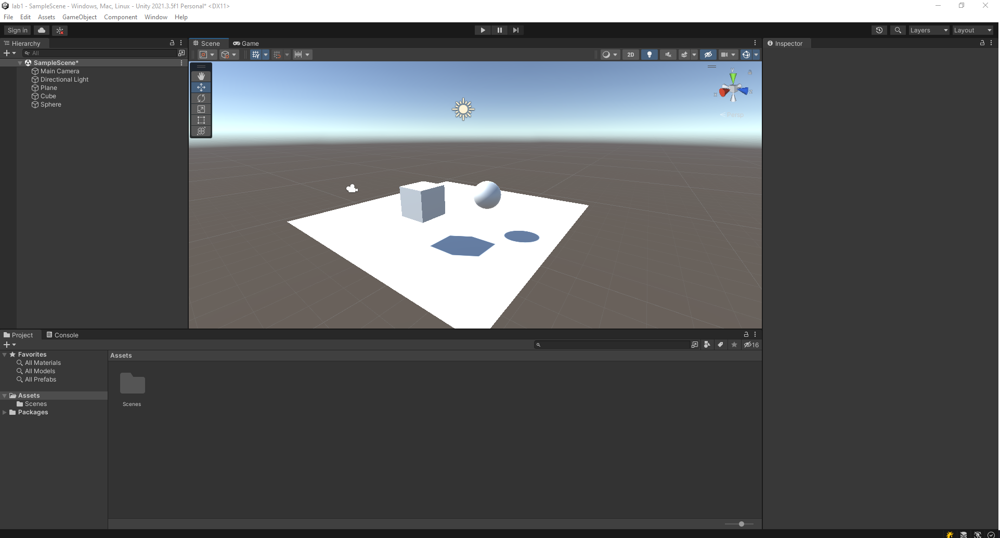

# АНАЛИЗ ДАННЫХ И ИСКУССТВЕННЫЙ ИНТЕЛЛЕКТ [in GameDev]
Отчет по лабораторной работе #1 выполнил(а):
- Абзапаров Николай Дмитриевич
- РИ300012
Отметка о выполнении заданий (заполняется студентом):

| Задание | Выполнение | Баллы |
| ------ | ------ | ------ |
| Задание 1 | * | 60 |
| Задание 2 | * | 20 |
| Задание 3 | * | 20 |

знак "*" - задание выполнено; знак "#" - задание не выполнено;

Работу проверили:
- к.т.н., доцент Денисов Д.В.
- к.э.н., доцент Панов М.А.
- ст. преп., Фадеев В.О.


Структура отчета

- Данные о работе: название работы, фио, группа, выполненные задания.
- Цель работы.
- Задание 1.
- Код реализации выполнения задания. Визуализация результатов выполнения (если применимо).
- Задание 2.
- Код реализации выполнения задания. Визуализация результатов выполнения (если применимо).
- Задание 3.
- Код реализации выполнения задания. Визуализация результатов выполнения (если применимо).
- Выводы.
- ✨Magic ✨

## Цель работы
Ознакомиться с основными функциями Unity.

## Задание 1
### В разделе «ход работы» пошагово выполнить каждый пункт с описанием и примера реализации задач по теме видео самостоятельной работы.
Ход работы:<br>
1) Создать новый проект из шаблона 3D – Core;
2) Проверить, что настроена интеграция редактора Unity и Visual Studio Code
(пункты 8-10 введения);
3) Создать объект Plane;
4) Создать объект Cube;
5) Создать объект Sphere;

7) Установить компонент Sphere Collider для объекта Sphere;
8) Настроить Sphere Collider в роли триггера;

9)  Объект куб перекрасить в красный цвет;
10) Добавить кубу симуляцию физики, при это куб не должен проваливаться
под Plane;

10) Написать скрипт, который будет выводить в консоль сообщение о том,
что объект Sphere столкнулся с объектом Cube;
11) При столкновении Cube должен менять свой цвет на зелёный, а при
завершении столкновения обратно на красный.
```c#
public class SphereController : MonoBehaviour
{
    private void OnTriggerEnter(Collider other)
    {
        if(other.gameObject.name == "Cube")
        {
            Debug.Log("Cube has entered Sphere");
            other.gameObject.GetComponent<Renderer>().material.color = Color.green;
        }
    }

    private void OnTriggerExit(Collider other)
    {
        if(other.gameObject.name == "Cube")
        {
            other.gameObject.GetComponent<Renderer>().material.color = Color.red;
        }
    }
}
```


## Задание 2
### Продемонстрируйте на сцене в Unity следующее:
- Что произойдёт с координатами объекта, если он перестанет быть
дочерним?
- Создайте три различных примера работы компонента RigidBody?
  
Ход работы:
1) Куб является родительским объектом по отношению к капсуле. Перемещая куб, капсула перемещается на такой же вектор.<br>

2) Капсула перестала быть дочерним объектом по отношению к кубу, поэтому при перемещении куб капсула не двигается.<br>

<br>
### Примеры работы RigitBody:
- Куб в кинематическом состоянии(isKinematic). Перемещение только через скрипты.
- Капсула в динамическом состоянии с Freeze position. Не перемещается, но можно прикладывать силы для вращения.
- Цилиндр в динамическом режиме с Freeze Rotation. Перемещать можно, есл иприкладывать силы в объекту. Не вращается.


## Задание 3
### Реализуйте на сцене генерацию n кубиков. Число n вводится пользователем после старта сцены.
Ход работы:
1) Создан пустой GameObject CubeSpawner, к нему прикреплен код CubeSpawnerController
   
 ``` c#
public class CubeSpawnerController : MonoBehaviour
{
    [SerializeField] TMP_InputField inputField;
    [SerializeField] GameObject CubePrefab;
    private void Start()
    {
        inputField.onSubmit.AddListener(delegate { SpawnCubes(); });
    }

    void SpawnCubes()
    {
        var count = int.Parse(inputField.text);
        for(var i = 0; i < count; i++)
        {
            var Cube = Instantiate(CubePrefab);
            var height = Cube.GetComponent<BoxCollider>().bounds.size.y;
            Cube.transform.position = new Vector3(0, i * height, 0);
        }
    }
}
```
2) Создан префаб куба красного цвета с компонентом RigidBody. Закинул ссылку на него в CubeSpawnerController
3) Создал объект InputField, ссылку на него скинул в CubeSpawnerController.


## Выводы

Научился работать в Unity на уровне "Смешарик".

## Powered by

**BigDigital Team: Denisov | Fadeev | Panov**
